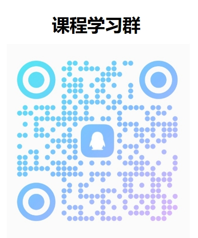

# 昇思MindSpore技术公开课

- ***探究前沿***：解读技术热点，解构热点模型
- ***应用实践***：理论实践相结合，手把手指导开发
- ***专家解读***：多领域专家，多元解读
- ***开源共享***：课程免费，课件代码开源
- ***大赛赋能***：ICT大赛赋能课程（大模型专题第一、二期）
- ***系列课程***：大模型专题课程开展中，其他专题课程敬请期待

## 报名方式

报名链接：https://xihe.mindspore.cn/course/foundation-model-v2/introduction 

（注：参与免费课程必须报名哦！同步添加[QQ群](./assets/groupchat_qq.png)，后续课程事宜将在群内通知！）

## 大模型专题第一期(已完结)&第二期（进行中）

第二期课程10月14日起每双周六14：00-15：00在[b站](https://live.bilibili.com/22127570?broadcast_type=0&is_room_feed=1&spm_id_from=333.999.to_liveroom.0.click&live_from=86002)进行直播。

每节课程的ppt和代码会随授课逐步上传至[github](https://github.com/mindspore-courses/step_into_llm)，系列视频回放归档至[b站](https://space.bilibili.com/526894060/channel/seriesdetail?sid=3293489)，大家可以在[昇思MindSpore公众号](./assets/wechat_official_account.png)中获取每节课的知识点回顾与下节课的课程预告，同时欢迎大家在[MindSpore社区](https://gitee.com/mindspore/community/issues)领取大模型系列任务进行挑战。

> 因为课程周期较长，课节安排可能会在中途出现微调，以最终通知为准，感谢理解！

> 热烈欢迎小伙伴们参与到课程的建设中来，基于课程的趣味开发可以提交至[昇思MindSpore大模型平台](https://xihe.mindspore.cn/)

> 如果在学习过程中发现任何课件及代码方面的问题，希望我们讲解哪方面的内容，或是对课程有什么建议，都可以直接在本仓库中创建issue

### 教研团队

### 课前学习

- python
- 人工智能基础、深度学习基础（重点学习自然语言处理）：[MindSpore-d2l](https://openi.pcl.ac.cn/mindspore-courses/d2l-mindspore)
- OpenI启智社区基础使用（可免费获取算力）：[OpenI_Learning](https://openi.pcl.ac.cn/zeizei/OpenI_Learning)
- MindSpore基础使用：[MindSpore教程](https://www.mindspore.cn/tutorials/zh-CN/r2.2/index.html)
- MindFormers基础使用：[MindFormers讲解视频](https://www.bilibili.com/video/BV1jh4y1m7xV/?spm_id_from=333.999.0.0)

### 课程介绍

昇思MindSpore技术公开课火热开展中，面向所有对大模型感兴趣的开发者，带领大家理论结合时间，由浅入深地逐步深入大模型技术

在已经完结的第一期课程（第1讲-第10讲）中，我们从Transformer开始，解析到ChatGPT的演进路线，手把手带领大家搭建一个简易版的“ChatGPT”

正在进行的第二期课程（第11讲-）在第一期的基础上做了全方位的升级，围绕大模型从开发到应用的全流程实践展开，讲解更前沿的大模型知识、丰富更多元的讲师阵容，期待你的加入！

| 章节序号 | 章节名称 | 课程简介                                        | 视频 | 课件及代码 | 知识点总结 |
|:----:|:----:|:--------------------------------------------|:----:|:----:|:----:|
| 第一讲 |    Transformer    | Multi-head self-attention原理。Masked self-attention的掩码处理方式。基于Transformer的机器翻译任务训练。                                                        | [link](https://www.bilibili.com/video/BV16h4y1W7us/?spm_id_from=333.999.0.0&vd_source=eb3a45e6eb4dccc5795f97586b78f4290) | [link](./Season1.step_into_chatgpt/1.Transformer/) | [link](./Season1.step_into_chatgpt/0.Course-Review/1-Transformer.md) |
| 第二讲 |       BERT        | 基于Transformer Encoder的BERT模型设计：MLM和NSP任务。BERT进行下游任务微调的范式。                                                                               | [link](https://www.bilibili.com/video/BV1xs4y1M72q/?spm_id_from=333.999.0.0&vd_source=eb3a45e6eb4dccc5795f97586b78f429) | [link](./Season1.step_into_chatgpt/2.BERT/) | [link](./Season1.step_into_chatgpt/0.Course-Review/2-BERT.md) |
| 第三讲 |        GPT        | 基于Transformer Decoder的GPT模型设计：Next token prediction。GPT下游任务微调范式。                                                                        | [link](https://www.bilibili.com/video/BV1Gh411w7HC/?spm_id_from=333.999.0.0&vd_source=eb3a45e6eb4dccc5795f97586b78f429) | [link](./Season1.step_into_chatgpt/3.GPT/) | [link](./Season1.step_into_chatgpt/0.Course-Review/3-GPT.md) |
| 第四讲 |       GPT2        | GPT2的核心创新点，包括Task Conditioning和Zero shot learning；模型实现细节基于GPT1的改动。                                                                      |  [link](https://www.bilibili.com/video/BV1Ja4y1u7xx/?spm_id_from=333.999.0.0&vd_source=eb3a45e6eb4dccc5795f97586b78f429) | [link](./Season1.step_into_chatgpt/4.GPT2/) | [link](./Season1.step_into_chatgpt/0.Course-Review/4-GPT2.md) |
| 第五讲 |   MindSpore自动并行   | 以MindSpore分布式并行特性为依托的数据并行、模型并行、Pipeline并行、内存优化等技术。                                                                                      |  [link](https://www.bilibili.com/video/BV1VN41117AG/?spm_id_from=333.999.0.0&vd_source=eb3a45e6eb4dccc5795f97586b78f429) | [link](./Season1.step_into_chatgpt/5.Parallel/) | [link](./Season1.step_into_chatgpt/0.Course-Review/5-Parallel.md) |
| 第六讲 |       代码预训练       | 代码预训练发展沿革。Code数据的预处理。CodeGeex代码预训练大模型。                                                                                                  |  [link](https://www.bilibili.com/video/BV1Em4y147a1/?spm_id_from=333.999.0.0&vd_source=eb3a45e6eb4dccc5795f97586b78f429) | [link](./Season1.step_into_chatgpt/6.CodeGeeX/) | [link](./Season1.step_into_chatgpt/0.Course-Review/6-CodeGeex.md) |
| 第七讲 |   Prompt Tuning   | Pretrain-finetune范式到Prompt tuning范式的改变。Hard prompt和Soft prompt相关技术。只需要改造描述文本的prompting。                                                 | [link](https://www.bilibili.com/video/BV1Wg4y1K77R/?spm_id_from=333.999.0.0&vd_source=eb3a45e6eb4dccc5795f97586b78f429) | [link](./Season1.step_into_chatgpt/7.Prompt/) | [link](./Season1.step_into_chatgpt/0.Course-Review/7-Prompt.md) |
| 第八讲 |     多模态预训练大模型     | 紫东太初多模态大模型的设计、数据处理和优势；语音识别的理论概述、系统框架和现状及挑战。                                                                                             | [link](https://www.bilibili.com/video/BV1wg4y1K72r/?spm_id_from=333.999.0.0&vd_source=eb3a45e6eb4dccc5795f97586b78f429) | / | / |
| 第九讲 |  Instruct Tuning  | Instruction tuning的核心思想：让模型能够理解任务描述（指令）。Instruction tuning的局限性：无法支持开放域创新性任务、无法对齐LM训练目标和人类需求。Chain-of-thoughts：通过在prompt中提供示例，让模型“举一反三”。 | [link](https://www.bilibili.com/video/BV1cm4y1e7Cc/?spm_id_from=333.999.0.0&vd_source=eb3a45e6eb4dccc5795f97586b78f429) | [link](./Season1.step_into_chatgpt/8.Instruction/) | [link](./Season1.step_into_chatgpt/0.Course-Review/8-Instruction.md) |
| 第十讲 |       RLHF        | RLHF核心思想：将LLM和人类行为对齐。RLHF技术分解：LLM微调、基于人类反馈训练奖励模型、通过强化学习PPO算法实现模型微调。                                                                     | [link](https://www.bilibili.com/video/BV15a4y1c7dv/?spm_id_from=333.999.0.0&vd_source=eb3a45e6eb4dccc5795f97586b78f429) | [link](./Season1.step_into_chatgpt/9.RLHF/) | 更新中 |
| 第十一讲  |      ChatGLM      | GLM模型结构，从GLM到ChatGLM的演变，ChatGLM推理部署代码演示| [link](https://www.bilibili.com/video/BV1ju411T74Y/?spm_id_from=333.999.0.0&vd_source=eb3a45e6eb4dccc5795f97586b78f429)  |[link](./Season2.step_into_llm/01.ChatGLM/)|[link](https://mp.weixin.qq.com/s/ZUoga1poFj49QPE3UNwE_w)|
| 第十二讲  |   多模态遥感智能解译基础模型   | 本次课程由中国科学院空天信息创新研究院研究员 实验室副主任 孙显老师讲解多模态遥感解译基础模型，揭秘大模型时代的智能遥感技术的发展与挑战、遥感基础模型的技术路线与典型场景应用| [link](https://www.bilibili.com/video/BV1Be41197wY/?spm_id_from=333.999.0.0&vd_source=eb3a45e6eb4dccc5795f97586b78f429)  | /| [link](https://mp.weixin.qq.com/s/gx4KxpSfqDooIKvS8sN2fA)|
| 第十三讲  |     ChatGLM2      | ChatGLM2技术解析，ChatGLM2推理部署代码演示，ChatGLM3特性介绍| [link](https://www.bilibili.com/video/BV1Ew411W72E/?spm_id_from=333.999.0.0&vd_source=eb3a45e6eb4dccc5795f97586b78f429)  | [link](./Season2.step_into_llm/02.ChatGLM2/) |[link](https://mp.weixin.qq.com/s/Mu29b7E4TxtJBkONOJQdEA)|
| 第十四讲  |     文本生成解码原理      | 以MindNLP为例，讲解搜索与采样技术原理和实现| [link](https://www.bilibili.com/video/BV1QN4y117ZK/?spm_id_from=333.999.0.0&vd_source=eb3a45e6eb4dccc5795f97586b78f429)  | [link](./Season2.step_into_llm/03.Decoding/) |[link](https://mp.weixin.qq.com/s/1WpiKb_1hPck_0EDnThmtA)|
| 第十五讲  |       LLAMA       | LLaMA背景及羊驼大家族介绍，LLaMA模型结构解析，LLaMA推理部署代码演示| [link](https://www.bilibili.com/video/BV1nN41157a9/?spm_id_from=333.999.0.0) | [link](./Season2.step_into_llm/04.LLaMA/) |  [link](https://mp.weixin.qq.com/s/9QdP062-agcIbsR0_a-b3g)  |
| 第十六讲  |      LLAMA2       | 介绍LLAMA2模型结构，走读代码演示LLAMA2 chat部署| [link](https://www.bilibili.com/video/BV1Me411z7ZV/?spm_id_from=333.999.0.0) | [link](./Season2.step_into_llm/05.LLaMA2/) | [link](https://mp.weixin.qq.com/s/kmuMocA2oPJQNTXAjBKZ9A) |                                 
| 第十七讲  |       鹏城脑海        | 鹏城·脑海200B模型是具有2千亿参数的自回归式语言模型，在中国算力网枢纽节点'鹏城云脑II'千卡集群上基于昇思MindSpore的多维分布式并行技术进行长期大规模训练。模型聚焦中文核心能力，兼顾英文和部分多语言能力，目前完成了1.8T token量的训练 | [link](https://www.bilibili.com/video/BV1AT4y1p7bJ/?spm_id_from=333.999.0.0&vd_source=eb3a45e6eb4dccc5795f97586b78f429)   |  / | [link](https://mp.weixin.qq.com/s/BVzOzP_EEV3b-CNnqiRNXA) |
| 第十八讲  |      CPM-Bee      | 介绍CPM-Bee预训练、推理、微调及代码现场演示 |[link](https://www.bilibili.com/video/BV1VZ4y1n7t9/?spm_id_from=333.999.0.0)  | [link](https://github.com/mindspore-courses/step_into_llm/tree/master/Season2.step_into_llm/07.CPM) |  [link](https://mp.weixin.qq.com/s/lalEtEzUTQRqS1M-6AEVow) |
| 第十九讲  |      RWKV1-4      | RNN的没落和Transformers的崛起 万能的Transformers？Self-attention的弊端 “拳打”Transformer的新RNN-RWKV 基于MindNLP的RWKV模型实践 |   [link](https://www.bilibili.com/video/BV1K4421w7Ha/?spm_id_from=333.999.0.0&vd_source=eb3a45e6eb4dccc5795f97586b78f429) | / | [link](https://mp.weixin.qq.com/s/n9uxjENUA-XQEXXO3BJiPA) |
| 第二十讲  |        MOE        | MoE的前世今生 MoE的实现基础：AlltoAll通信； Mixtral 8x7b: 当前最好的开源MoE大模型，MoE与终身学习，基于昇思MindSpore的Mixtral 8x7b推理演示。           |   [link](https://www.bilibili.com/video/BV1jH4y177DL/?spm_id_from=333.999.0.0&vd_source=eb3a45e6eb4dccc5795f97586b78f429) | [link](https://github.com/mindspore-courses/step_into_llm/tree/master/Season2.step_into_llm/08.MoE)  |  [link](https://mp.weixin.qq.com/s/QubiOzpEau6dqMgFAVhxog) |
| 第二十一讲 |     高效参数微调      | 介绍Lora、（P-Tuning）原理及代码实现 | [link](https://www.bilibili.com/video/BV11D421j7fZ/?spm_id_from=333.999.0.0&vd_source=eb3a45e6eb4dccc5795f97586b78f429)  | [link](https://github.com/mindspore-courses/step_into_llm/tree/master/Season2.step_into_llm/09.PEFT) | [link](https://mp.weixin.qq.com/s/EAge4XZEG8vsyAvQFXZrhA) |
| 第二十二讲 |Prompt Engineering | Prompt engineering：1.什么是Prompt？2.如何定义一个Prompt的好坏或优异? 3.如何撰写优质的Prompt？4.如何产出一个优质的Prompt？ 5.浅谈一些我们在进行Prompt的时候遇到的问题。   | [link](https://www.bilibili.com/video/BV1aD421W73q/?spm_id_from=333.999.0.0&vd_source=eb3a45e6eb4dccc5795f97586b78f429) |  / |[link](https://mp.weixin.qq.com/s/CTVpcpKZA3E6oZftwpdgEA) |
| 第二十三讲 |  多维度混合并行自动搜索优化策略  | 议题一·时间损失模型及改进多维度二分法/议题二·APSS算法应用   | [上](https://www.bilibili.com/video/BV1if421X7jB/?spm_id_from=333.999.0.0&vd_source=eb3a45e6eb4dccc5795f97586b78f429)   [下](https://www.bilibili.com/video/BV1QM4m1z7FV/?spm_id_from=333.999.0.0&vd_source=eb3a45e6eb4dccc5795f97586b78f429) | [link](https://mp.weixin.qq.com/s/8OufiPX4FLbgj8ztnckcWQ)  | 
|第二十四讲 |   书生.浦语大模型开源全链工具链简介与智能体开发体验| 在本期课程中，我们有幸邀请到了书生.浦语社区技术运营、技术布道师闻星老师，以及昇思MindSpore技术布道师耿力老师，来详细解读书生.浦语大模型开源全链路工具链，演示如何对书生.浦语进行微调、推理以及智能体开发实操。| [link](https://www.bilibili.com/video/BV1K4421w7Ha/?spm_id_from=333.999.0.0&vd_source=eb3a45e6eb4dccc5795f97586b78f429) |    /     | [link](https://mp.weixin.qq.com/s/uh_RIThOEzkkWVbK_RBALQ)  |
| 第二十五讲 |        RAG        |     |     |     |     |
| 第二十六讲 |   LangChain模块解析   | 解析Models、Prompts、Memory、Chains、Agents、Indexes、Callbacks模块，及案例分析 |     |     |      |
| 第二十七讲 |      RWKV5-6      |      /    |     |     |      |
| 第二十八讲 |        量化         | 介绍低比特量化等相关模型量化技术|       |      |     |

### 昇思资源一览：生态与伙伴共建、共享、共荣

### 加入我们

<table>
    <tr>
        <td>

</td>
        <td>

</td>
        <td>

</td>
    </tr>
