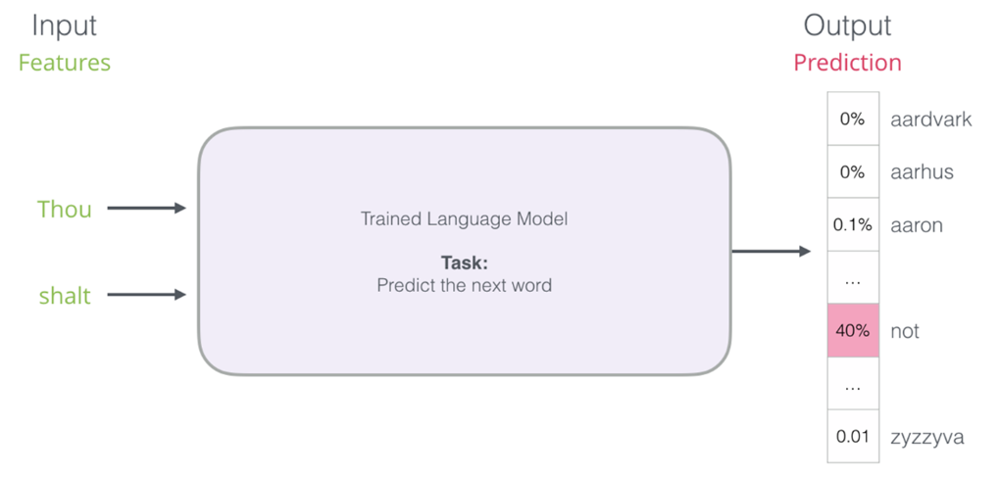
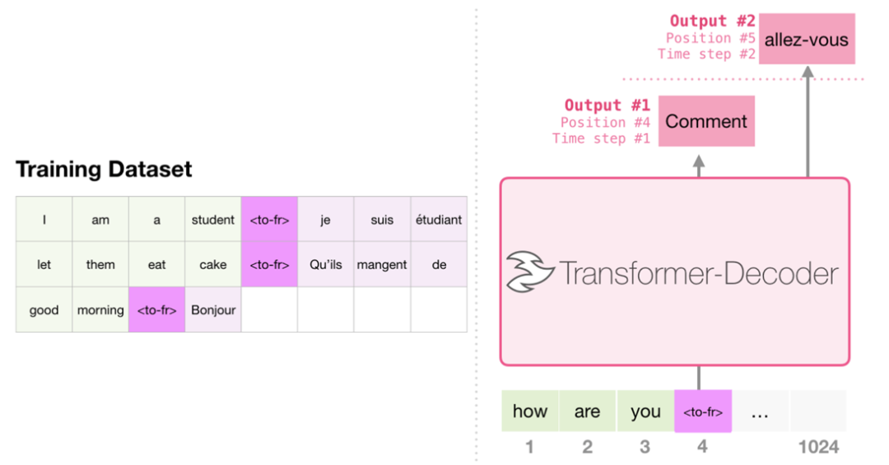
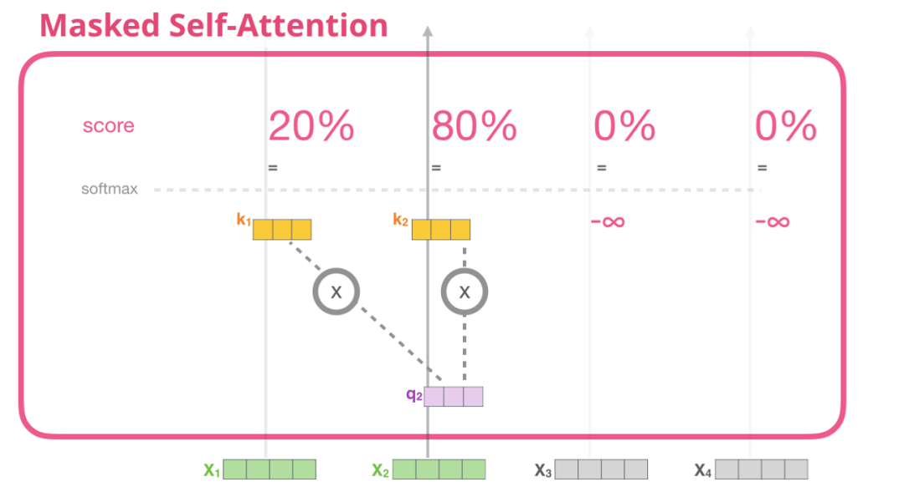

# GPT2课程回顾

本节课我们继续为大家讲解了GPT2的核心创新点以及模型实现细节，并且将Transformer Decoder结构的核心部分Masked Self-attention进行了示意图和单步代码一一对应的详细解读。大家是否对GPT模型有了更加深入的理解呢？

接下来我们对课程进行简单回顾，迎接下一节公开课的进一步深入。

## 1.课程回顾

GPT2论文解读：
- Language Model任务的再解读：Next Token Predict和自回归预测

- Task Conditioning

    GPT2实现Zero Shot的核心方法，针对不同任务设计Task Condition（即Task instruction）进行预训练，面向新的生成任务，可以不进行有标注的微调，而使用instruction来引导模型生成结果。

## 2. 课程实践

- Masked Self-Attention的单步详解：

    

    - 创建query、key、value
    - 切分Attention heads
    - 计算Attention Socre，需要加入Causal Mask来防止前面单词看到未来。
    - 合并Attention heads
    - 进行一层Projection
- 使用GPT2训练一个文本摘要模型（自回归预训练）：
    - 自回归任务的处理：
        1. 静态文本长度，处理为1024，需要进行pad和truncate
        2. 输入和输出分别为text[0:-1]和text[1:]
    - 使用自动混合精度，配合Loss Scalar解决溢出问题
    - 自回归的文本生成预测