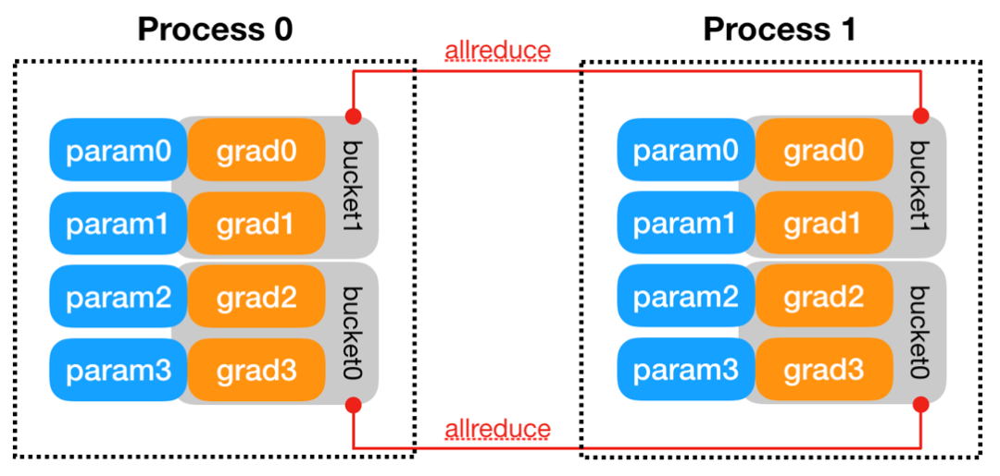
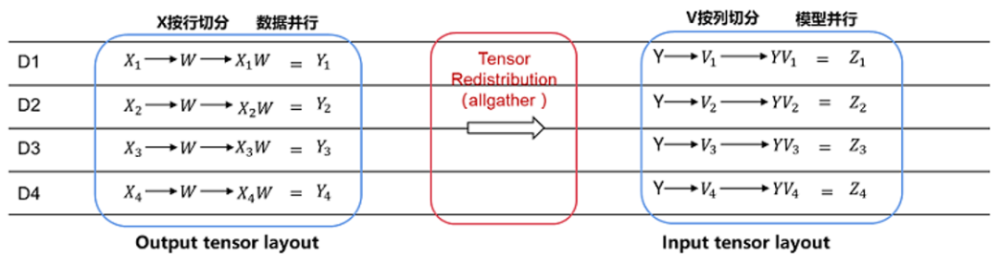
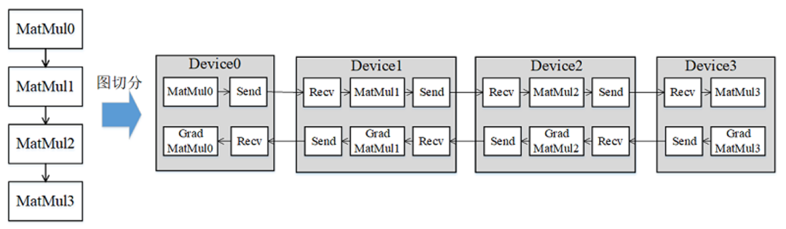
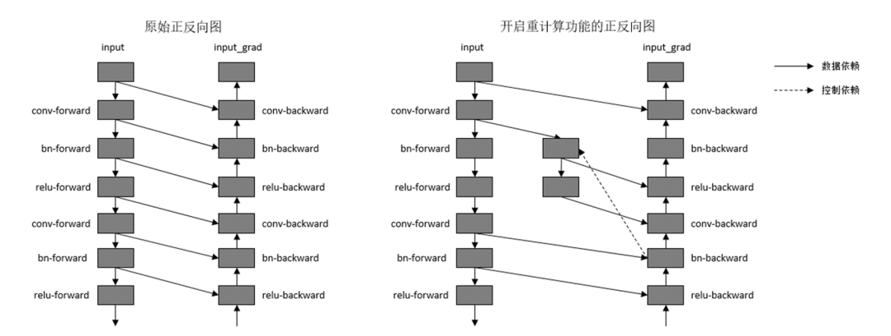
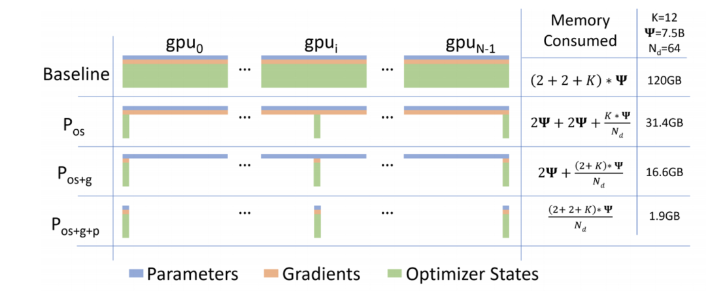

# MindSpore分布式并行特性讲解回顾

继Transformer到BERT、GPT2的讲解，相信大家对大模型前期的技术和模型细节有了更深入的了解。本节课我们为大家带来LLM（Large Language Model）预训练的基础——分布式并行技术的讲解。

以昇思MindSpore分布式并行特性为依托，详细解释了数据并行、模型并行、Pipeline并行、内存优化等技术，并邀请了昇思MindSpore分布式并行专家苏腾博士进行了《昇腾+昇思超大规模AI实践》分享，向大家展示了昇思MindSpore在大规模预训练模型上的前沿实践。

接下来我们对课程进行简单回顾，迎接下一节公开课的进一步深入。

## 1. 课程回顾

***昇腾+昇思超大规模AI实践***

- 大模型的发展以及对系统的挑战
    1. 内存墙
    2. 性能墙
    3. 效率墙
    4. 调优墙
- 昇思MindSpore大模型关键技术：
    1. 原生大模型支持
    2. 大模型使能套件
    3. 大模型分布式推理
    4. 大模型集群调优
    5. 大集群快速故障恢复
    6. 昇腾亲和的Transformer融合算子
- 昇思MindSpore大模型训练案例：
    1. 鹏程盘古千亿稠密大模型训练实例
    2. 盘古sigma稀疏多任务大模型异构训练

***昇思MindSpore分布式并行特性***

- 数据并行

    

    1. 每一张卡上放置相同的模型参数、梯度、优化器状态
    2. 不同的卡送入不同的数据训练
    3. 反向传播获得梯度后，进行AllReduce

- 模型并行

    

    模型并行是算子层面的并行，它利用某些算子的特性将算子拆分到多个设备上进行计算

- Pipeline并行

    

    流水线（Pipeline）并行是将神经网络中的算子切分成多个阶段（Stage），再把阶段映射到不同的设备上，使得不同设备去计算神经网络的不同部分。

- 内存优化
    1. 重计算
    
        

        时间换空间：重计算技术可以不保存正向计算结果，让该内存可以被复用，然后在计算反向部分时，重新计算出正向结果。
    
    2. 优化器并行——ZeRO
    
        

        将参数和梯度分组放到不同卡上更新，再通过通信广播操作在设备间共享更新后的权值。

- 昇思MindSpore自动并行

    用户的神经网络在单卡上无法计算，但是不知道如何配置算子策略。用户启动这种模式，MindSpore会自动针对每个算子进行配置策略，适合想要并行训练但是不知道如何配置策略的用户。