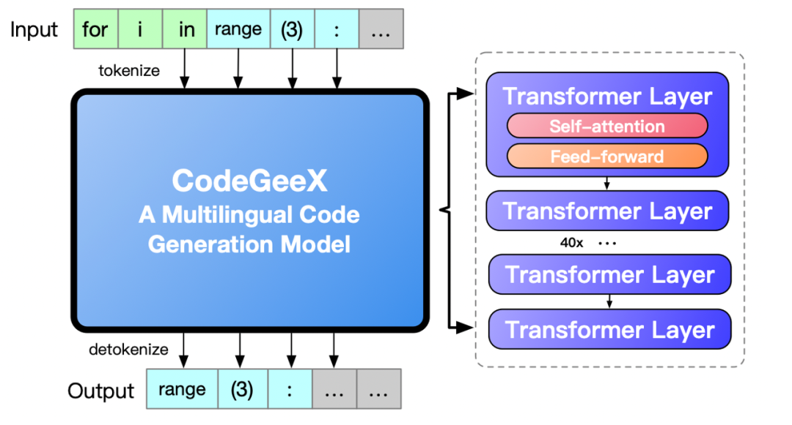
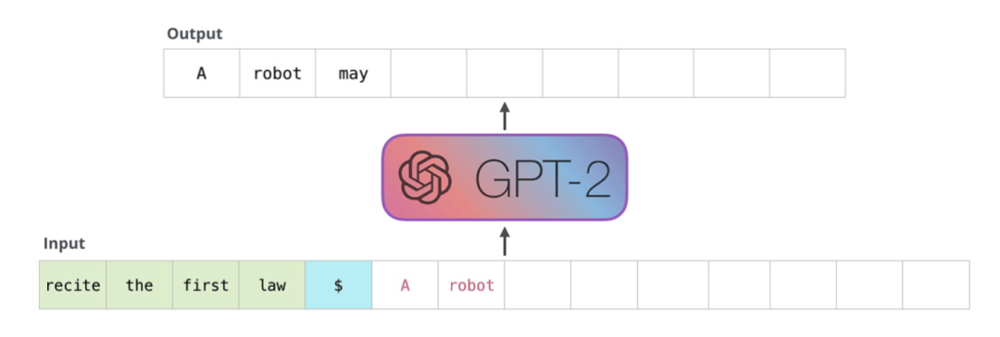

# 代码预训练课程回顾

本节课我们邀请到清华大学知识工程实验室的夏箫同学进行代码大模型的技术分析，讲解了代码预训练模型发展历程中，并从数据预处理到模型性能评估完整地回顾了开源大规模多语言代码生成模型CodeGeeX的开发过程。

接下来我们对课程进行简单的回顾，迎接下一节公开课的进一步深入

## 代码预训连的发展历程

***代码预训练任务***

1. 程序生成
2. 注释生成/代码解释
3. 代码翻译

***代码预训练模型***

1. 针对代码的Transformer
    - CodeBERT
    - GraphCodeBERT
2. 大规模生成模型
    - CodeX
    - InCoder
    - CodeGen
    - CodeGeex

## CodeGeex——开源的大规模多语言代码生成模型：

***代码预训练模型处理***

1. 数据集选取

2. 数据清洗：文件去重、去除无效文件

3. 编程语言标签：标记编程语言，添加复杂元信息

4. 标识符化：基于GPT-2 BPE tokenizer分词，并将连续空格转换为特殊空格词符

5. 序列切分：文件切分为登场序列

***CodeGeeX模型架构：基于GPT架构的自回归模型***

模型并行是算子层面的并行，它利用某些算子的特性将算子拆分到多个设备上进行计算。

***CodeGeeX模型预训练***

使用昇思MindSpore + 昇腾910组合进行训练，使用自然语言活代码token作为输入，输出下一个token的概率。

1. 混合精度

2. 并行训练：数据并行+模型并行

***CodeGeeX模型优化策略***

1. 算子融合

2. 矩阵乘算子自动搜索出效率最高的计算维度组合

***代码生成模型性能评估***

1. 语义相似性无法正确反应生成代码的质量，需要同时考虑代码功能的正确性。

    - 基于相似性（参考生成对比）：BLEU、Rouge、CodeBLEU

    - 基于正确性（运行测试用例）：通过率

2. 目前的基准从多任务及多语言两个方面对模型进行评价

    - 多任务
    
        通过不同应用场景进行评价，多使用CodeBLEU/BLEU评价相似性

    - 多语言
    
        在不同编程语言下评价代码正确性，如HumanEval（仅支持Python）、MultiPL-E（支持16种语言，但为自动翻译并不支持多任务）

3. HumanEval-X：新的多语言代码生成基准

    支持五种编程语言，保证正确性，可进行多语言代码生成及跨语言代码翻译两种下游任务

***CodeGeeX代码生成插件***

1. 自动模式

2. 交互模式

3. 翻译模式

4. 解释模式

5. 提示模式

6. Chat模式