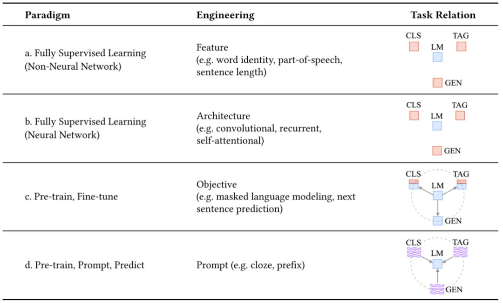
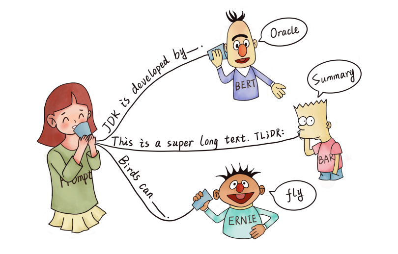
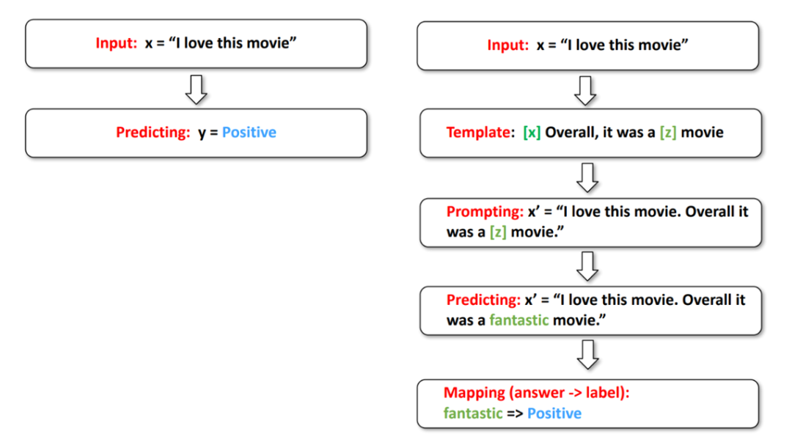
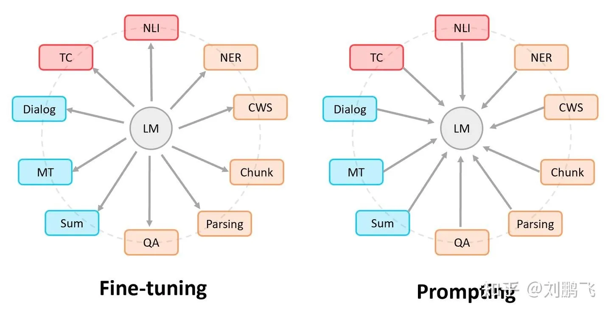
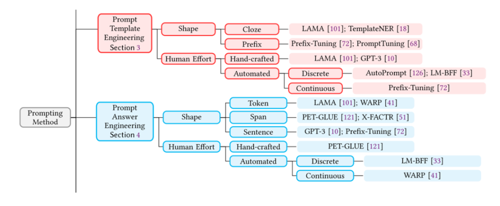
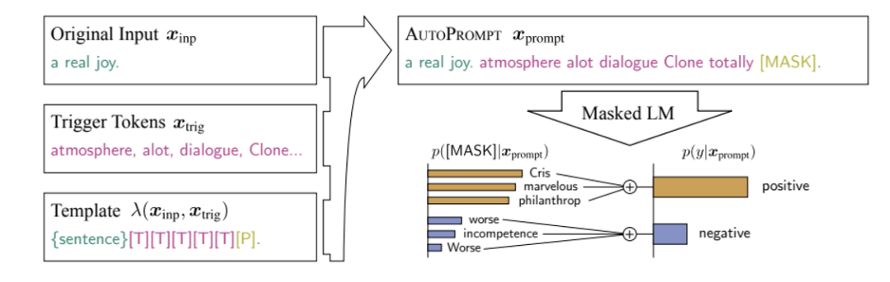
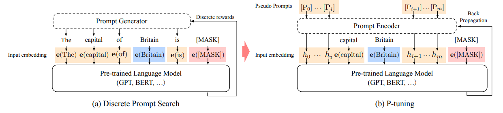
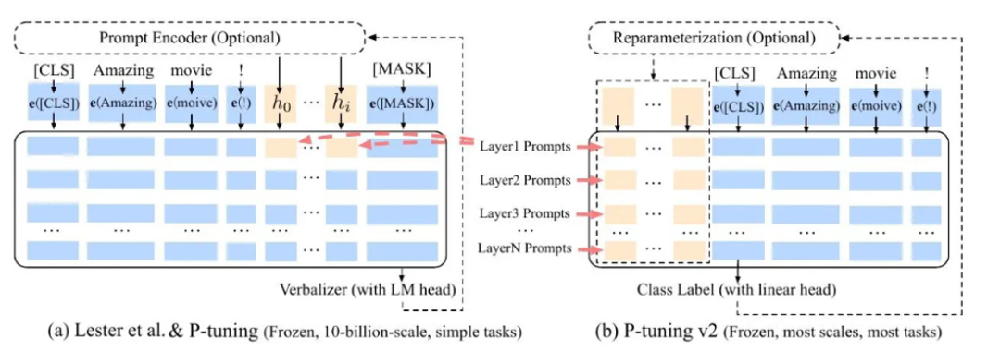

# Prompt Tuning课程回顾

随着大模型的逐步发展，我们发现在模型参数规模不断增大的同时，finetune的计算成本不断攀高，并且出现了finetune部分参数以适配下游任务的方法效果并不理想的情况。

由此发展出了新的技术路线———prompt tuning。通过针对特定任务设计一组有效的提示，指导模型更好地理解下游任务，从而生成更加准确的输出。

接下来我们对课程进行简单回顾，迎接下一节公开课的进一步深入。

## Pre-train, fine-tune to pre-train, prompt, predict

***NLP发展过程中的四个范式***

***Pre-train + Fine-tune回顾***

1. BERT：Masked LM + NSP，注重文本理解

2. GPT：auto-regressive model，注重文本生成

3. Pre-train + Fine-tune面临的问题

    - Pre-train 与 Fine-tune 间的语义差异

    - 由少样本引发的过拟合

    - Fine-tune及模型部署成本较大

***新范式：Pre-train, Prompt, Predict***

1. Prompting定义

    通过提供指定要执行的任务的“提示”，鼓励预训练模型进行特定的预测，一般以完形填空的方式呈现。

    

2. Workflow of Prompting

    重点是对Prompt Template与Verbalizer的设计

    

    1. 准备输入 input

    2. 建立prompt模板（prompt template）

    3. 将input代入模板，形成prompt

    4. 模型基于prompt生成预测单词，即完型填空部分的内容

    5. 根据verbalizer中单词与标签的映射，输出标签

***两种范式的区别***

Fine-tuning 是通过调整模型以适配不同的下游任务应用（模型迁就任务），Prompting 是通过调整对下游任务的描述来适配模型（任务迁就模型）。

## Prompting

***Prompt分类***

***Prompt Template Engineering***

根据prompt格式（shape）和生成方式的不同，prompt有不同的分类。根据任务类型和预训练模型，选择合适的prompt。

- Prompt shape

    1. Cloze template

    2. Prefix template

- Manual template learning

    人工创建prompt，根据以往经验来构建，但人类认为合适的prompt并不一定是最适合模型的prompt

- Automated template learning

    AutoPrompt：gradient based prompt search in discrete space

    

## Prompt-based Finetuning

将数据-标签的supervised data，转化成自然语言提示，并以此进行模型的微调。

***P-Tuning***

模型自动在连续空间中搜索prompt表达，并引入soft prompt概念。

将预训练语言模型的input embedding（输入单词经过embedding层的结果）替换为differential output embedding（类似于hidden state的连续性表示）。

***P-Tuning v2***

将prompt作为前缀加入模型的每一层。

