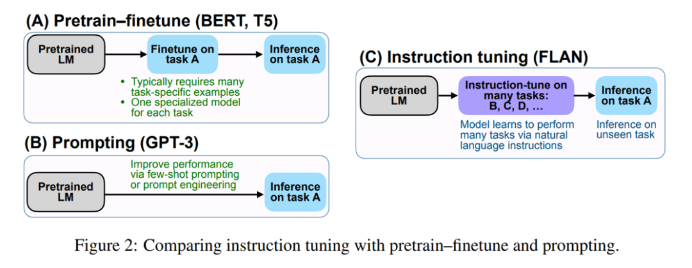
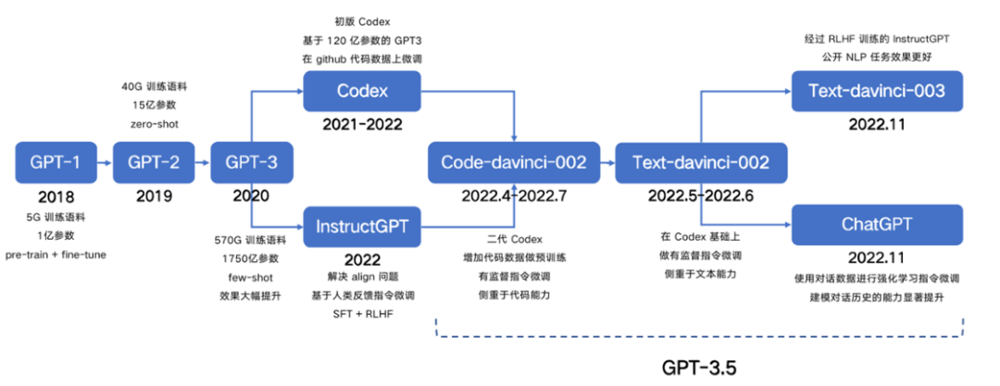
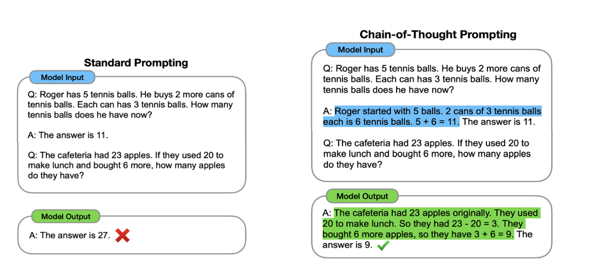

# Instruction Tuning 课程回顾

Instruction Tuning 是谷歌提出的多任务微调方法。和Prompt Tuning的核心相同，其目的是挖掘语言模型本身具备的知识。

但Instruction Tuning并非通过prompt来激发语言模型的不全能力，而是激发语言模型的理解能力，通过给出明显的指令，让模型去理解并给出正确的反馈。

在ChatGPT的前身InstructGPT上，通过高效的指令微调实现了在相比GPT-3少了100倍参数量的模型输出效果优于GPT-3以及用监督学习进行微调的模型效果。

Instruction Tuning仿照人类学习的模型，通过简单看下任务定义以及对应示例，就能很好地理解任务要求，从而完成对应的任务指令。

## Instruction Tuning

- Instruction Tuning的核心思想：让模型能够理解任务描述（指令）。

- FLAN模型：finetune LM better understand task description via other。

    通过Instruction Tuning来提高大模型的zero-shot能力。

- Instruction Tuning和prompting的区别对比

- Instruction Tuning的局限性

    1. 问题1：无法支持开放域创新性的任务，如写小说。

    2. 问题2：语言模型对token-level的错误是同等惩罚的，但是实际上不同的token错误带来的影响差异会很大

    3. 问题3：即使使用Instruction Tuning，还是没法将LM的训练目标和人类的需求对齐。

## InstructGPT

从GPT到ChatGPT的发展，InstructGPT是ChatGPT的前身，Instruction Finetuning是ChatGPT必备的技术之一。

## Chain-of-thoughts

- 思维链随着模型规模的增大，开始出现，被称为大模型的涌现能力。

- 思维链Prompting可以通过在prompt中提供示例，让模型“举一反三”。

- 使用Let’s think step by step.这种Zero-shot的思维链提示，也能让模型性能大幅提升。

- 新时代的职业，Prompt工程师。