# 技术公开课内容测试任务12

任务链接：https://gitee.com/mindspore/community/issues/IC700Z#note_43798754

测试内容：Season2.step_into_llm/15.pipeline测试任务

## 环境配置

基于mindspore 2.6.0 和 mindnlp 0.4.1（mindnlp 0.4.0 与 mindspore 2.6.0 有部分接口不兼容。mindnlp 0.4.0 调用了mindspore._c_expression.Tensor，而mindspore 2.6.0 对应的接口应为mindspore._c_expression.TensorPy）

```
!pip install mindspore==2.6.0
!pip install mindnlp==0.4.1
```

## pipeline测试

### automatic_speech_recognition

需要安装 torchcodec 包

mindnlp 的 AutoProcessor 没有对应的 tokenizer 和 feature_extractor 属性，此处需要调整：

```python
from mindnlp.transformers import WhisperFeatureExtractor, AutoTokenizer
feature_extractor = WhisperFeatureExtractor.from_pretrained(model_id)
tokenizer = AutoTokenizer.from_pretrained(model_id)

pipe = pipeline(
    "automatic-speech-recognition",
    model=model,
    tokenizer=tokenizer,  
    feature_extractor=feature_extractor,  
    max_new_tokens=128,
    chunk_length_s=30,
    batch_size=16,
    return_timestamps=True,
    ms_dtype=mindspore.float16,
)
```

最后运行结果如下，使用完整的sample运行时间过长，此处截取了部分数据计算。

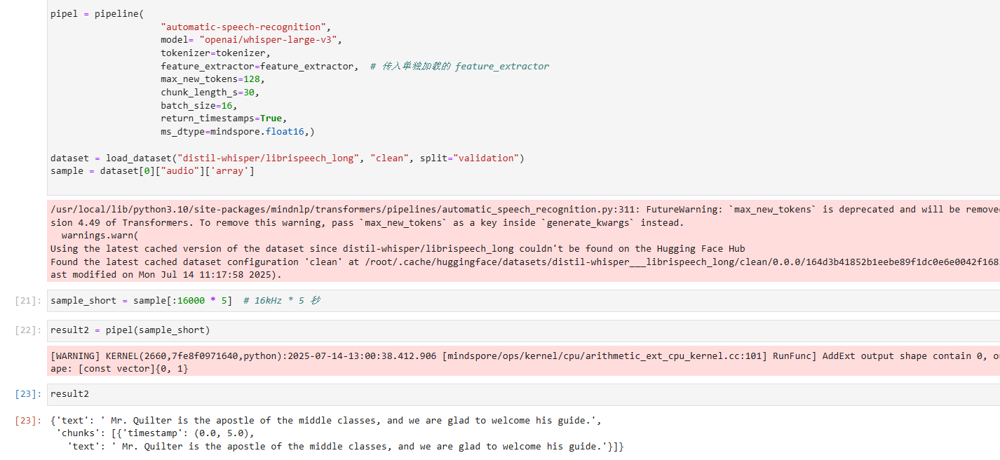

### document_question_answering

需要安装pytesseract环境，参考教程：https://blog.csdn.net/m0_37576542/article/details/132315537

**示例1：**

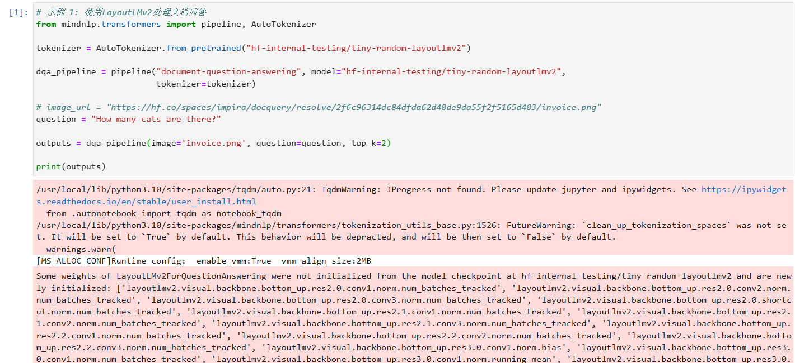

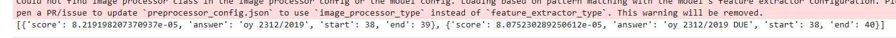

**示例2：**pipeline接口发生变化，需要接受的参数为图像和 word_boxes，因此需要修改图像处理函数和 dqa_pipeline 参数

```python
def process_image_and_ocr(image_path):
    image = Image.open(image_path)
    ocr_result = pytesseract.image_to_data(image, output_type=pytesseract.Output.DICT)
    
    boxes = [
        [ocr_result["left"][i], ocr_result["top"][i], ocr_result["width"][i], ocr_result["height"][i]]
        for i in range(len(ocr_result["text"]))
        if ocr_result["text"][i].strip() 
    ]

    words = [word for word in ocr_result["text"] if word.strip()]
    
    return words, boxes, image.size

def normalize_boxes(boxes, image_width, image_height):
    normalized_boxes = []
    for box in boxes:
        left, top, width, height = box
        x1 = left / image_width * 1000
        y1 = top / image_height * 1000
        x2 = (left + width) / image_width * 1000
        y2 = (top + height) / image_height * 1000
        normalized_boxes.append((x1, y1, x2, y2))
    return normalized_boxes

words, boxes, (image_width, image_height) = process_image_and_ocr(image_path)
normalized_boxes = normalize_boxes(boxes, image_width, image_height)
word_boxes = list(zip(words, normalized_boxes))
```

```python
tokenizer = AutoTokenizer.from_pretrained(MODEL_DIR, revision="9977165")

dqa_pipeline = pipeline("document-question-answering", model=MODEL_DIR,
                        tokenizer=tokenizer)

image_path = "invoice.png"

new_word_boxes = []
for item in word_boxes:
    text = item[0]
    box = item[1]   # 四个浮点数
    # 将box的四维坐标转换为整数（四舍五入）
    int_box = [round(x) for x in box]   # 四舍五入取整
    new_word_boxes.append([text, int_box])

question = "What is the invoice number?"

outputs = dqa_pipeline(image=image, question=question, word_boxes=new_word_boxes, top_k=2)
```

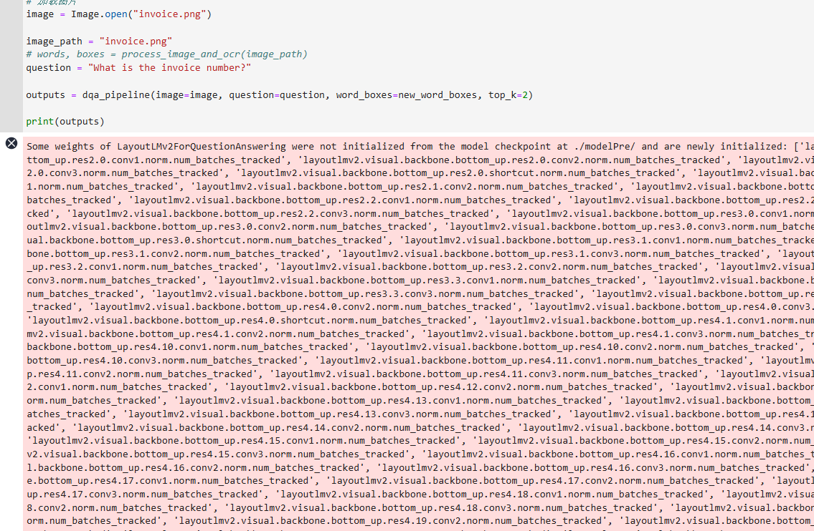

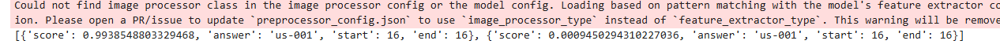

### fill_mask_demo

执行结果与预期结果精度基本相同。

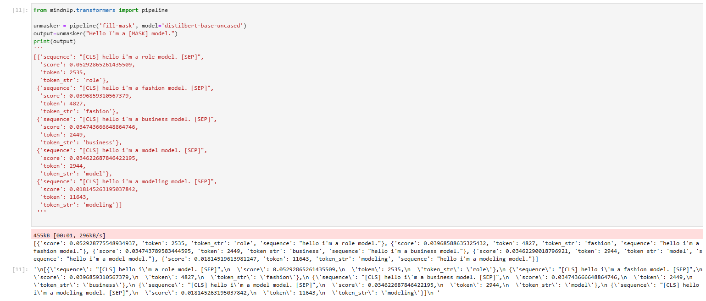

### question_answering_demo

执行结果与预期结果精度基本相同。

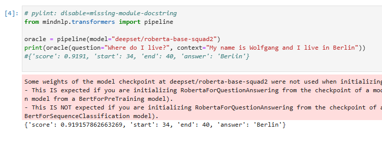

### text_generation_demo

加载模型时出现报错：SafeTensorError::InvalidOffset(h.3.ln_2.bias)；需要修改模型的加载方式，禁用 SafeTensor

```python
generator = pipeline(
    model="openai-community/gpt2", 
    model_kwargs={
        'force_download': True,
        'resume_download': False,
        'use_safetensors': False  
    }
)
```

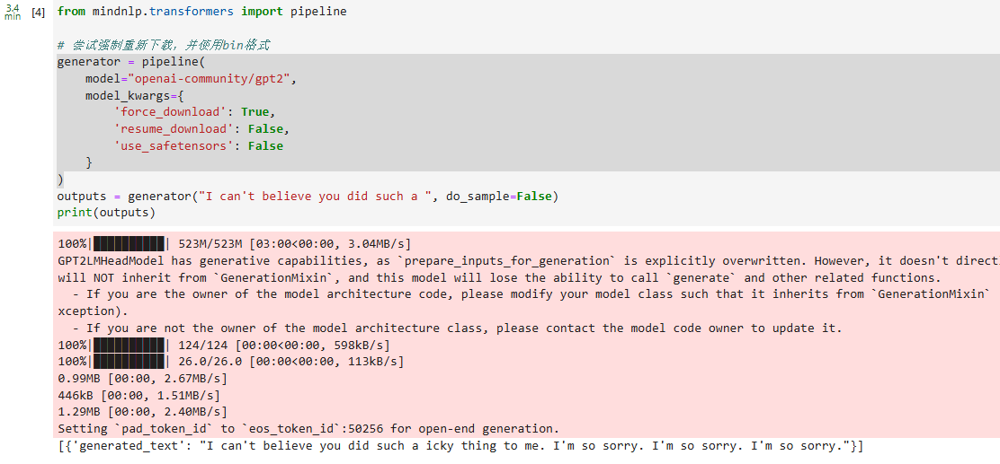

在进行对话demo时，tokenizer默认没有设置`chat_template`， 此处需要设置：

```python
from mindnlp.transformers import  AutoTokenizer
# 加载 tokenizer 并设置 chat template
tokenizer = AutoTokenizer.from_pretrained("openai-community/gpt2")
tokenizer.chat_template = "{{'<|im_start|>' + message['role'] + '\n' + message['content'] + '<|im_end|>' + '\n'}}{{ '<|im_start|>assistant\n' }}"

# 创建 pipeline 时传入自定义 tokenizer
generator = pipeline("text-generation", model="openai-community/gpt2", tokenizer=tokenizer,
                    model_kwargs={
                    'use_safetensors': False  
                })
                
outputs = generator(chat1, do_sample=False, max_new_tokens=10)
print(outputs)

outputs = generator([chat1, chat2], do_sample=False, max_new_tokens=10)
print(outputs)
```

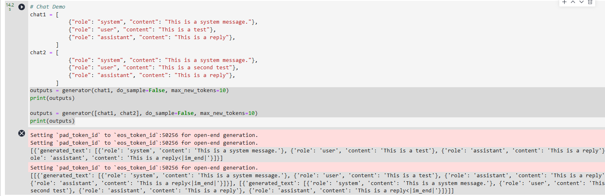

### text2text_generation_demo

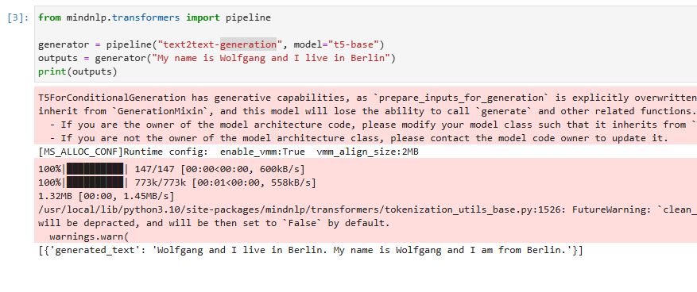

### zero_shot_classification_demo

输出结果与预期结果精度基本一致

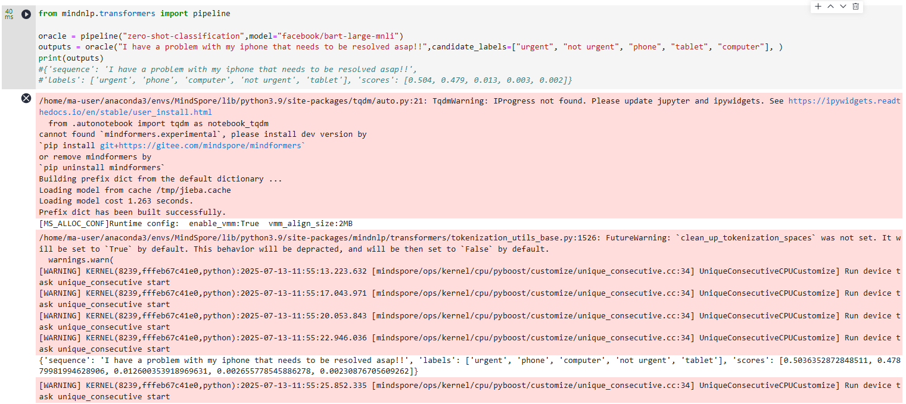

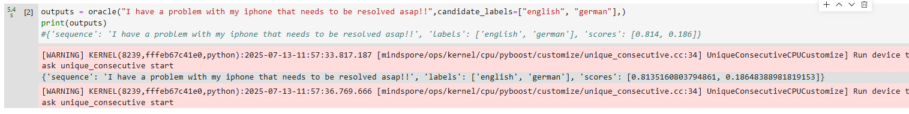

备注：

mindnlp.transformers.modeling_attn_mask_utils.py 的 _make_causal_mask 的 mask 创建方式是：

```python
mask = mask.masked_fill(mask_cond < (mask_cond + 1).view(mask.shape[-1], 1), 0)
mask = mask.to(dtype)
```

而在 CPU 上 mindspore 不支持 [float32, bool, int64] --> [float32]。建议可以修改 mask 创建方式为：

```python
mask = mask.masked_fill(mask_cond < (mask_cond + 1).view(mask.shape[-1], 1), mindspore.Tensor(0, mask.dtype))
```

