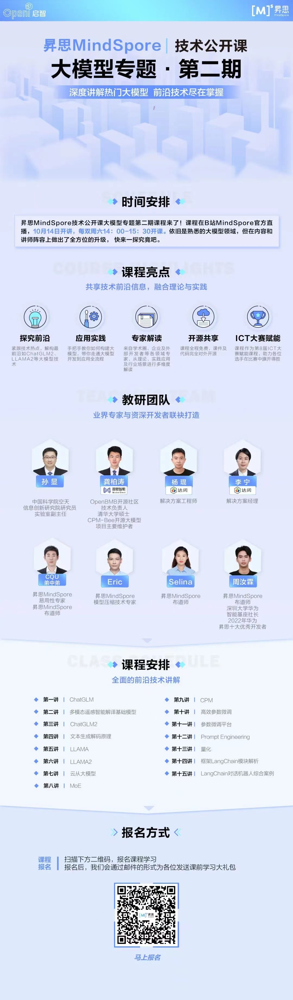

# 昇思MindSpore技术公开课大模型专题第二期

昇思MindSpore技术公开课大模型专题（第二期）开课啦！

第二期课程在第一期基础上做了全面的升级，对第一期课程意犹未尽的小伙伴可以来继续一起学习大模型啦，也非常欢迎新的小伙伴加入！

学术圈、企业、优秀开发者等各领域大咖讲师齐聚MindSpore为各位开发者教学，课程全程免费，对大模型领域感兴趣的小伙伴速速报名啦！

## 课程总览

### 课前学习

- python
- 人工智能基础、深度学习基础（重点学习自然语言处理）：[MindSpore-d2l](https://openi.pcl.ac.cn/mindspore-courses/d2l-mindspore)
- MindSpore基础使用：[MindSpore教程](https://www.mindspore.cn/tutorials/zh-CN/r2.2/index.html)
- MindFormers基础使用：[MindFormers讲解视频](https://www.bilibili.com/video/BV1jh4y1m7xV/?spm_id_from=333.999.0.0)
- 昇思MindSpore技术公开课大模型专题第一期课程：[step_into_chatgpt](../Season1.step_into_chatgpt/)

## 课程安排

> 因为课程周期较长，课节安排可能会在中途出现微调，以最终授课情况为准，感谢理解

| 章节序号  |        章节名称        | 课程简介                                                                                                                                    |                                                            视频                                                            |                                                课件及代码                                                |                                知识点总结                                 |
|:-----:|:------------------:|:----------------------------------------------------------------------------------------------------------------------------------------|:------------------------------------------------------------------------------------------------------------------------:|:---------------------------------------------------------------------------------------------------:|:--------------------------------------------------------------------:|
|  第一讲  |    Transformer     | Multi-head self-attention原理。Masked self-attention的掩码处理方式。基于Transformer的机器翻译任务训练。                                                        | [link](https://www.bilibili.com/video/BV16h4y1W7us/?spm_id_from=333.999.0.0&vd_source=eb3a45e6eb4dccc5795f97586b78f4290) |                         [link](./Season1.step_into_chatgpt/1.Transformer/)                          | [link](./Season1.step_into_chatgpt/0.Course-Review/1-Transformer.md) |
|  第二讲  |        BERT        | 基于Transformer Encoder的BERT模型设计：MLM和NSP任务。BERT进行下游任务微调的范式。                                                                               | [link](https://www.bilibili.com/video/BV1xs4y1M72q/?spm_id_from=333.999.0.0&vd_source=eb3a45e6eb4dccc5795f97586b78f429)  |                             [link](./Season1.step_into_chatgpt/2.BERT/)                             |    [link](./Season1.step_into_chatgpt/0.Course-Review/2-BERT.md)     |
|  第三讲  |        GPT         | 基于Transformer Decoder的GPT模型设计：Next token prediction。GPT下游任务微调范式。                                                                        | [link](https://www.bilibili.com/video/BV1Gh411w7HC/?spm_id_from=333.999.0.0&vd_source=eb3a45e6eb4dccc5795f97586b78f429)  |                             [link](./Season1.step_into_chatgpt/3.GPT/)                              |     [link](./Season1.step_into_chatgpt/0.Course-Review/3-GPT.md)     |
|  第四讲  |        GPT2        | GPT2的核心创新点，包括Task Conditioning和Zero shot learning；模型实现细节基于GPT1的改动。                                                                      | [link](https://www.bilibili.com/video/BV1Ja4y1u7xx/?spm_id_from=333.999.0.0&vd_source=eb3a45e6eb4dccc5795f97586b78f429)  |                             [link](./Season1.step_into_chatgpt/4.GPT2/)                             |    [link](./Season1.step_into_chatgpt/0.Course-Review/4-GPT2.md)     |
|  第五讲  |   MindSpore自动并行    | 以MindSpore分布式并行特性为依托的数据并行、模型并行、Pipeline并行、内存优化等技术。                                                                                      | [link](https://www.bilibili.com/video/BV1VN41117AG/?spm_id_from=333.999.0.0&vd_source=eb3a45e6eb4dccc5795f97586b78f429)  |                           [link](./Season1.step_into_chatgpt/5.Parallel/)                           |  [link](./Season1.step_into_chatgpt/0.Course-Review/5-Parallel.md)   |
|  第六讲  |       代码预训练        | 代码预训练发展沿革。Code数据的预处理。CodeGeex代码预训练大模型。                                                                                                  | [link](https://www.bilibili.com/video/BV1Em4y147a1/?spm_id_from=333.999.0.0&vd_source=eb3a45e6eb4dccc5795f97586b78f429)  |                           [link](./Season1.step_into_chatgpt/6.CodeGeeX/)                           |  [link](./Season1.step_into_chatgpt/0.Course-Review/6-CodeGeex.md)   |
|  第七讲  |   Prompt Tuning    | Pretrain-finetune范式到Prompt tuning范式的改变。Hard prompt和Soft prompt相关技术。只需要改造描述文本的prompting。                                                 | [link](https://www.bilibili.com/video/BV1Wg4y1K77R/?spm_id_from=333.999.0.0&vd_source=eb3a45e6eb4dccc5795f97586b78f429)  |                            [link](./Season1.step_into_chatgpt/7.Prompt/)                            |   [link](./Season1.step_into_chatgpt/0.Course-Review/7-Prompt.md)    |
|  第八讲  |     多模态预训练大模型      | 紫东太初多模态大模型的设计、数据处理和优势；语音识别的理论概述、系统框架和现状及挑战。                                                                                             | [link](https://www.bilibili.com/video/BV1wg4y1K72r/?spm_id_from=333.999.0.0&vd_source=eb3a45e6eb4dccc5795f97586b78f429)  |                                                  /                                                  |                                  /                                   |
|  第九讲  |  Instruct Tuning   | Instruction tuning的核心思想：让模型能够理解任务描述（指令）。Instruction tuning的局限性：无法支持开放域创新性任务、无法对齐LM训练目标和人类需求。Chain-of-thoughts：通过在prompt中提供示例，让模型“举一反三”。 | [link](https://www.bilibili.com/video/BV1cm4y1e7Cc/?spm_id_from=333.999.0.0&vd_source=eb3a45e6eb4dccc5795f97586b78f429)  |                         [link](./Season1.step_into_chatgpt/8.Instruction/)                          | [link](./Season1.step_into_chatgpt/0.Course-Review/8-Instruction.md) |
|  第十讲  |        RLHF        | RLHF核心思想：将LLM和人类行为对齐。RLHF技术分解：LLM微调、基于人类反馈训练奖励模型、通过强化学习PPO算法实现模型微调。                                                                     | [link](https://www.bilibili.com/video/BV15a4y1c7dv/?spm_id_from=333.999.0.0&vd_source=eb3a45e6eb4dccc5795f97586b78f429)  |                             [link](./Season1.step_into_chatgpt/9.RLHF/)                             |                                 更新中                                  |
| 第十一讲  |      ChatGLM       | GLM模型结构，从GLM到ChatGLM的演变，ChatGLM推理部署代码演示                                                                                                 | [link](https://www.bilibili.com/video/BV1ju411T74Y/?spm_id_from=333.999.0.0&vd_source=eb3a45e6eb4dccc5795f97586b78f429)  |                             [link](./Season2.step_into_llm/01.ChatGLM/)                             |                                 更新中                                  |
| 第十二讲  |   多模态遥感智能解译基础模型    | 大模型时代的遥感智能，遥感基础模型技术路线，遥感领域典型场景应用                                                                                                        | [link](https://www.bilibili.com/video/BV1Be41197wY/?spm_id_from=333.999.0.0&vd_source=eb3a45e6eb4dccc5795f97586b78f429)  |                                                  /                                                  |                                  /                                   |
| 第十三讲  |      ChatGLM2      | ChatGLM2技术解析，ChatGLM2推理部署代码演示，ChatGLM3特性介绍                                                                                              | [link](https://www.bilibili.com/video/BV1Ew411W72E/?spm_id_from=333.999.0.0&vd_source=eb3a45e6eb4dccc5795f97586b78f429)  |                            [link](./Season2.step_into_llm/02.ChatGLM2/)                             |                                 更新中                                  |
| 第十四讲  |      文本生成解码原理      | 以MindNLP为例，讲解搜索与采样技术原理和实现                                                                                                               | [link](https://www.bilibili.com/video/BV1QN4y117ZK/?spm_id_from=333.999.0.0&vd_source=eb3a45e6eb4dccc5795f97586b78f429)  |                            [link](./Season2.step_into_llm/03.Decoding/)                             |                                 更新中                                  |
| 第十五讲  |       LLAMA        | LLaMA背景及羊驼大家族介绍，LLaMA模型结构解析，LLaMA推理部署代码演示                                                                                               |                       [link](https://www.bilibili.com/video/BV1nN41157a9/?spm_id_from=333.999.0.0)                       |                              [link](./Season2.step_into_llm/04.LLaMA/)                              |                                 更新中                                  |
| 第十六讲  |       LLAMA2       | 介绍LLAMA2模型结构，走读代码演示LLAMA2 chat部署                                                                                                        |                       [link](https://www.bilibili.com/video/BV1Me411z7ZV/?spm_id_from=333.999.0.0)                       |                             [link](./Season2.step_into_llm/05.LLaMA2/)                              |                                 更新中                                  
| 第十七讲  |        鹏城脑海        | /                                                                                                                                       |                                                         [link](https://www.bilibili.com/video/BV1AT4y1p7bJ/?spm_id_from=333.999.0.0&vd_source=eb3a45e6eb4dccc5795f97586b78f429)                                                         |                                                  /                                                  |                                 更新中                                  
| 第十八讲  |      CPM-Bee       | 介绍CPM-Bee预训练、推理、微调及代码现场演示                                                                                                               |      [link](https://www.bilibili.com/video/BV1VZ4y1n7t9/?spm_id_from=333.999.0.0)                                                                                                                    | [link](https://github.com/mindspore-courses/step_into_llm/tree/master/Season2.step_into_llm/07.CPM) |  更新中
| 第十九讲  |      RWKV1-4       | /                                                                                                                                       |   [link](https://www.bilibili.com/video/BV1K4421w7Ha/?spm_id_from=333.999.0.0&vd_source=eb3a45e6eb4dccc5795f97586b78f429)                                                                                                                       |                                                  /                                                  |更新中
| 第二十讲  |        MOE         | /                                                                                                                                       |                                                                                                                          |                                                                                                     |
| 第二十一讲 |       高效参数微调       | 介绍Lora、（P-Tuning）原理及代码实现                                                                                                                |                                                                                                                          |                                                                                                     |
| 第二十二讲 |       参数微调平台       | /                                                                                                                                       |                                                                                                                          |                                                                                                     |
| 第二十三讲 | Prompt Engineering | /                                                                                                                                       |                                                                                                                          |                                                                                                     |
| 第二十四讲 |         量化         | 介绍低比特量化等相关模型量化技术                                                                                                                        |                                                                                                                          |                                                                                                     |
| 第二十五讲 |         RWKV5-6        | /                                                                                                                                       |                                                                                                                          |                                                                                                     |
| 第二十六讲 |  框架LangChain模块解析   | 解析Models、Prompts、Memory、Chains、Agents、Indexes、Callbacks模块，及案例分析                                                                         |                                                                                                                          |                                                                                                     |
| 第二十七讲 | LangChain对话机器人综合案例 | MindSpore Transformers本地模型与LangChain框架组合使用，通过LangChain框架管理向量库并基于向量库对MindSpore Transformers本地模型问答进行优化                                    |                                                                                                                          |                                                                                                     |

注：章节序号接昇思MindSpore技术公开课第一期
